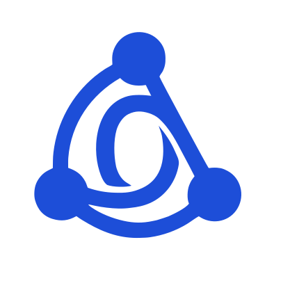

# OrgOS Collective — Brand Identity Guidelines

_Official brand documentation for the non-profit association (Verein)._

This guide is the single source of truth for the OrgOS Collective visual identity.
All assets referenced here live alongside this document in the
[`brand-kit`](../README.md) package.

## Table of contents

1. [Brand essence & positioning](#1-brand-essence--positioning)
2. [The logo mark: the "Collective Node"](#2-the-logo-mark-the-collective-node)
3. [Color palette: "Fresh Innovation"](#3-color-palette-fresh-innovation)
4. [Typography stack](#4-typography-stack)
5. [Visual applications & layout logic](#5-visual-applications--layout-logic)
6. [Asset reference](#6-asset-reference)

---

## 1. Brand essence & positioning

The **OrgOS Collective** is an agile, practitioner-driven non-profit association
(Verein) designed to bridge the gap between AI hype and enterprise reality. It
functions as a collaborative "concept-hardening forge" where tech leaders
stress-test next-generation automation and Software Factory architectures.

### Core principles to maintain

- **Strictly contribution (no spectators):** The brand must feel like an active
  workshop, not a passive, corporate broadcast.
- **The protected space (Geschützter Raum):** Visuals should reinforce security,
  mutual trust, and high-level peer-to-peer consulting.
- **Human-centric engineering:** Balancing hardcore enterprise automation
  architectures with the authentic, human connection of an independent collective.

---

## 2. The logo mark: the "Collective Node"

The logo abstracts complex network topologies into a streamlined, highly
recognizable emblem.

- **Geometry:** Three primary nodes arranged in a stable triangle, symbolizing
  the foundational threshold of a resilient community network.
- **The central "O":** Thick, organic, curved lines connect the three points and
  intersect in the center to form an abstract letter **"O"** (for OrgOS).
- **Usage rule:** The mark is highly versatile and must always be usable in full
  monochrome (solid white on a dark background, or solid dark blue/black on a
  cream canvas).

---

## 3. Color palette: "Fresh Innovation"

This palette avoids standard corporate rigidity, blending high-energy tech
signals with warm, approachable community tones.

| Element | Color name | Hex | Purpose / application |
| :-- | :-- | :-- | :-- |
| **Primary accent** | Electric Cobalt Blue | `#1D4ED8` | Dominant brand mark color, links, primary buttons, and focal points. |
| **Supporting accent** | Aurora Green | `#34D399` | Secondary highlights, status indicators, and innovation callouts. |
| **Primary canvas** | Papyrus Cream | `#F8F4E6` | Default background for web interfaces, documents, and event spaces. |
| **Text & contrast** | Slate Black | `#334155` | Body text, subtle borders, and structural interface elements. |

---

## 4. Typography stack

To ensure global accessibility across open-source web assets and community
portals, the entire type system relies strictly on open-source
[Google Fonts](https://fonts.google.com/).

### Primary display font: Kalam

- **Application:** Main logo text ("ORGOS COLLECTIVE") and H1/H2 headings on
  marketing or public-facing assets.
- **Tone:** Eccentric, handwriting-inspired, and distinctly personal. It signals
  to incoming CTOs and architects that this is an authentic, practitioner-built
  community rather than an anonymous corporate entity.
- **Rule:** Use sparingly. Never use Kalam for blocks of text or subheadings
  below H2.

### Primary body font: Montserrat

- **Application:** Subheadings, paragraph text, code annotations, navigation
  interfaces, and the core claim/tagline (_"driving next-gen automation, agentic
  architectures, and enterprise governance"_).
- **Tone:** Clean, geometric, hyper-legible, and modern. It anchors the eccentric
  handwriting of Kalam back into a precise, engineering-driven reality.

---

## 5. Visual applications & layout logic

**The contrast rule:** When designing the public content area or the secure
closed-members portal, always lead with structural clarity. Let **Montserrat** do
90% of the heavy lifting for readability, using **Kalam** and **Electric Cobalt
Blue** as deliberate, high-impact design accents to draw the eye to core community
actions (e.g., "Join the Association" or "Submit an Abstract").

---

## 6. Asset reference

| Asset | Path |
| :-- | :-- |
| Primary logo (vector) | [`logo/orgos-collective-logo.svg`](../logo/orgos-collective-logo.svg) |
| Logo on blue background | [`logo/orgos-collective-logo-blue.png`](../logo/orgos-collective-logo-blue.png) |
| Logo on transparent background | [`logo/orgos-collective-logo-transparent.png`](../logo/orgos-collective-logo-transparent.png) |
| Mood board | [`mood-board/orgos-collective-mood-board.png`](../mood-board/orgos-collective-mood-board.png) |
| PDF export of this guide | [`guidelines/brand-identity-guidelines.pdf`](./brand-identity-guidelines.pdf) |
